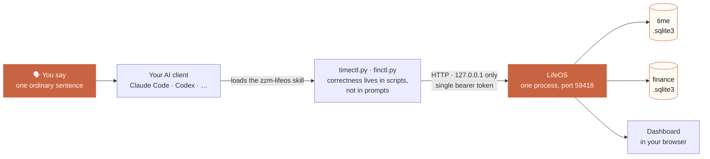
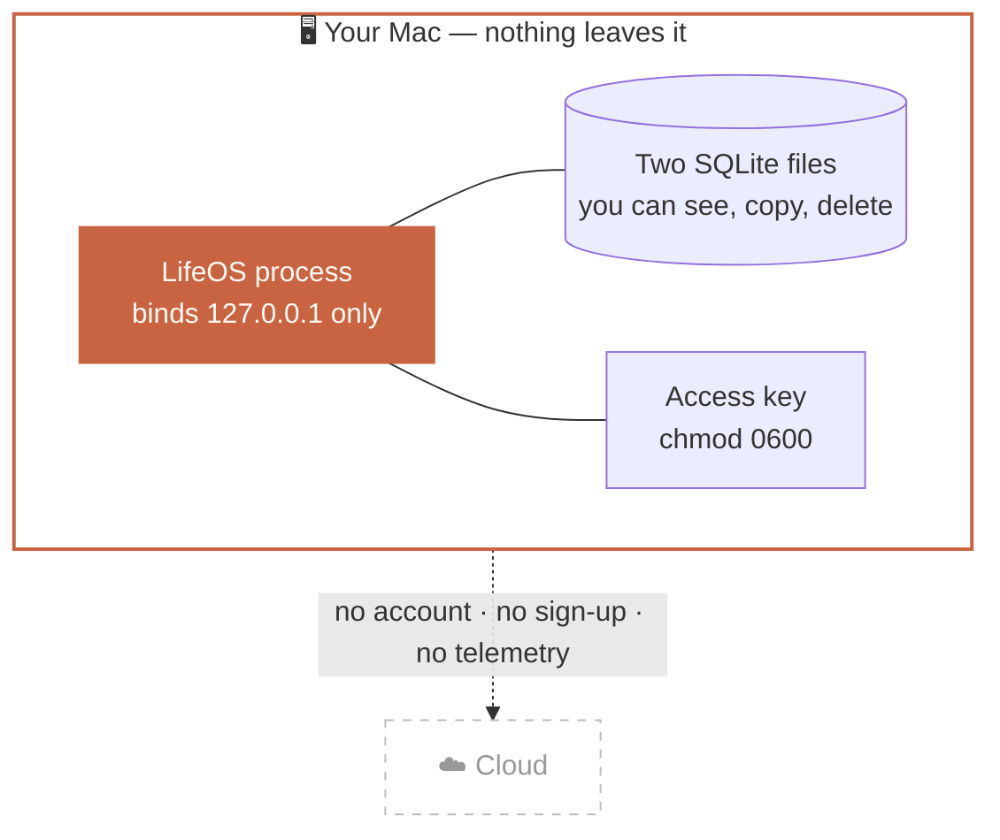

<p align="center">
  <picture>
    <source media="(prefers-color-scheme: dark)" srcset="docs/assets/banner-dark.svg">
    
  </picture>
</p>

<p align="center">
  <a href="LICENSE"></a>
  
  
  
  
</p>

<p align="center">
  <b>English</b> · <a href="README.zh-CN.md">简体中文</a> · <a href="docs/安装指南.md">安装指南</a>
</p>

---

**LifeOS logs where your time goes and where your money goes — by listening to you talk.**

No app to open. No form to fill. You say one ordinary sentence to your AI assistant, and it writes the record for you:

> 🗣 *"I started writing the proposal at nine, just finished."*
>
> 🗣 *"Lunch was 38 yuan, paid with WeChat."*

Then you open a page on your own machine and see the day laid out — which hours went where, which yuan went where.

> **Note** — LifeOS ships a Chinese-language interface and assistant protocol; it is built for Chinese-speaking users. This README is in English so the design is legible to everyone. The user-facing version is [简体中文](README.zh-CN.md).

## How it works



The assistant only decides **what you meant**. Every judgement that has to be right — date arithmetic, money direction, account lookup, the receipt you get back — is made by deterministic scripts and by the server, never by a prompt. A write that fails must be reported as failed.

**Two ledgers, one door.** Time and money share the entry point and nothing else. They live in two separate SQLite files that are never attached, never joined, never in one transaction — each with its own lock, its own write-ahead log, its own audit snapshots.

## What it records

<table>
<tr><th width="50%">⏱ Time</th><th width="50%">💴 Money</th></tr>
<tr valign="top"><td>

- Every stretch of activity: start, end, what you were doing, which project
- A timeline of your day — see at a glance which hours are logged and which are blank
- Statistics by category and by project

</td><td>

- Income, expense, transfer, reimbursement
- Account balances, monthly totals, where money came from and went
- Attach a receipt photo to any entry
- Export to Excel (plus a simplified tax sheet)

</td></tr>
</table>

## Install

The full walkthrough — every step, what you should see, and what to do when you don't — is in the [安装指南](docs/安装指南.md). Three ways in:

### 1 · Let your AI install it (recommended)

If you use an AI client that can run commands, paste this to it and wait:

```text
请帮我在这台 Mac 上安装 LifeOS，严格按下面的步骤做，不要跳步、不要自己发挥：

1. 打开 https://github.com/zhaozimin/LifeOS/releases/latest ，
   下载名字形如 lifeos-install-skill-1.1.0.zip 的附件，以及它旁边同名的 .sha256 文件。
2. 用 shasum -a 256 -c 校验这个 zip。校验不通过就立刻停下来告诉我，不要继续。
3. 解压，把里面的 zzm-lifeos-install 整个文件夹放进你自己的 skills 目录
   （Claude Code 通常是 ~/.claude/skills/，别的 Agent 用你自己的那个）。
4. 执行这一条命令，让脚本自己完成剩下的全部安装：
   python3 ~/.claude/skills/zzm-lifeos-install/scripts/lifeos_bootstrap.py install
5. 脚本跑完会打印一行面板地址和一个文件路径。把那一行原样发给我。
6. 中途任何一步报错，把报错原文发给我，不要自己猜着改。
```

The installer checks the download's sha256 before anything touches your disk, refuses to overwrite an installation it cannot identify as its own, and hands you the dashboard address exactly once.

### 2 · Download the release

Grab `lifeos-1.1.0.zip` from the [latest release](https://github.com/zhaozimin/LifeOS/releases/latest), verify it, unpack it, run one command. See [安装指南](docs/安装指南.md) → 路径二.

### 3 · From source

```bash
git clone https://github.com/zhaozimin/LifeOS.git
```

See [安装指南](docs/安装指南.md) → 路径三. **No Node.js required** — the dashboard ships prebuilt.

## Using it

Once it is installed you never type a command again. You just talk.

| You say | What lands in the ledger |
| --- | --- |
| 「我开始写代码了」 | Opens a time segment, now; category inferred from your habits |
| 「刚才开会开了一个半小时」 | A closed 90-minute segment, backfilled |
| 「接下来去健身」 | Closes the current segment and opens the next in one transaction — no one-minute gap |
| 「打车花了 25」 | An expense of ¥25; account and category inferred |
| 「工资到账了 12000」 | Income of ¥12000 |
| 「还了信用卡 3000」 | A transfer, not an income — the credit-card guardrail is structural |
| 「昨天下午其实是在改 bug，帮我改过来」 | Corrects the existing record, keeping a full before/after version chain |
| 「我这周都干了啥」 | Reads your week back to you |
| 「这个月花了多少」 | Reads the month back to you |

Every write comes back with a one-line receipt you can eyeball. Time lines never carry a `¥`; money lines always do. When one sentence contains both — *"just finished lunch, 45 yuan"* — it is split into two separate writes and you see both receipts.

**The assistant asks before it invents.** It never silently creates a category, project or account that doesn't exist: the server rejects unknown master data outright and sends the assistant back to you first.

## Privacy is the architecture, not a promise



- **No cloud, no account, no telemetry.** There is no server to sign in to.
- The process binds `127.0.0.1` — **only this machine can reach it**, not even others on your Wi-Fi.
- Both ledgers are plain files on your disk. You can see the path, copy them, delete them.
- The access key lives in one `0600` file; no other account on the machine can read it.
- Want it on your phone? You add a Tailscale layer yourself ([安装指南](docs/安装指南.md), last section). Without that it stays local, permanently.
- It records **only when you speak to it**. It does not read your screen, does not sample system activity, does not watch you in the background.

## Requirements

| | |
| --- | --- |
| OS | macOS |
| Python | 3.9+ (the system one is usually enough) |
| Node.js | Not needed — the dashboard is prebuilt |
| Dependencies | Exactly one: `openpyxl`, and only for Excel export |

## Documentation

| I want to… | Read |
| --- | --- |
| Install it, find the dashboard, set up autostart | [安装指南](docs/安装指南.md) |
| Back up my data, move to a new machine | [备份与恢复](docs/备份与恢复.md) |
| Know what this version still can't do | [已知问题](docs/已知问题.md) |
| Understand the codebase | `CLAUDE.md` at the repo root |

> **Read [备份与恢复](docs/备份与恢复.md) before you come to rely on this.** There is no one-click restore in this version — backup is on you, and copying the wrong file loses data (the ledgers run in WAL mode, so the `.sqlite3` file alone is not the whole story).

Verify a checkout yourself — no network, nothing written outside temp directories:

```bash
cd server              && python3 -m unittest discover        # 202 — server, both domains, deployment gate
cd docs                && python3 -m unittest test_docs_contract          #  25 — the manuals match the code
cd skills/zzm-lifeos/scripts        && python3 -m unittest discover       #  12 — skill pure functions
cd skills/zzm-lifeos-install/scripts && python3 -m unittest discover      #  30 — installer verdicts
```

## License & disclaimer

**MIT** — see [LICENSE](LICENSE). Use it, change it, redistribute it; keep the copyright and licence notice.

LifeOS is provided as is, with no warranty of any kind. It is a **recording tool, not a financial adviser** — the tax sheet only rearranges numbers you entered yourself and is not tax, investment or financial advice. Your data lives on your machine, which means **backing it up is your responsibility**.
