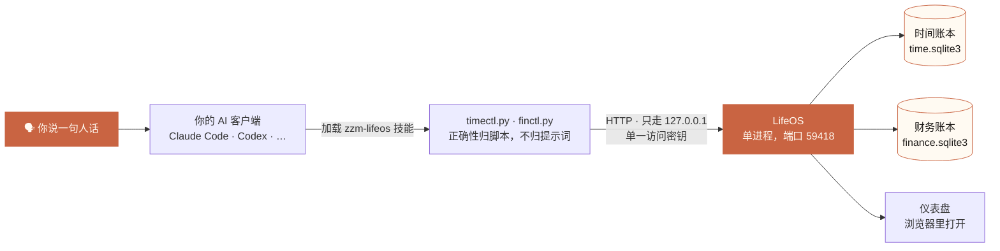
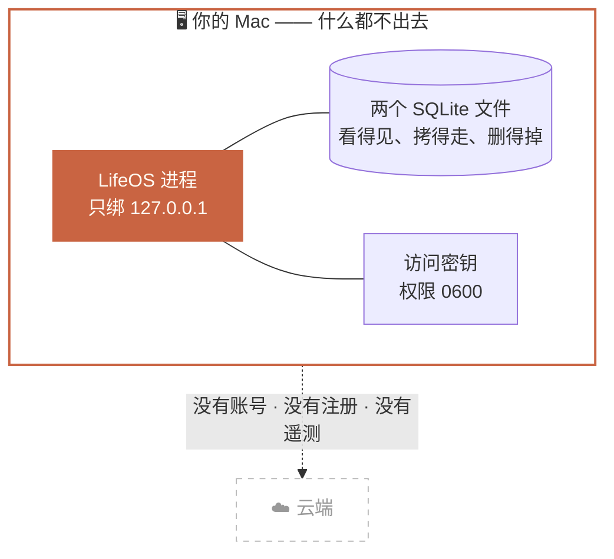

<p align="center">
  <picture>
    <source media="(prefers-color-scheme: dark)" srcset="docs/assets/banner-dark.svg">
    
  </picture>
</p>

<p align="center">
  <a href="LICENSE"></a>
  
  
  
  
</p>

<p align="center">
  <a href="README.md">English</a> · <b>简体中文</b> · <a href="docs/安装指南.md">安装指南</a>
</p>

---

## 会说话，就会记录人生

LifeOS 把你的**时间**和**金钱**记在同一个地方。你不用打开 App，也不用填表格——对 AI 说一句人话，它替你记好：

> 🗣 「我从九点开始写方案，刚写完。」
>
> 🗣 「中午吃饭花了 38 块，微信支付。」

记完之后，在自己电脑上打开一个网页，就能看到今天的时间去了哪里、这个月的钱去了哪里。

## 它是怎么工作的



AI 只负责判断**你想说什么**。凡是必须算对的——日期算术、钱的方向、账户查找、给你看的那行回执——全部由确定性的脚本和服务端裁定，不交给提示词。写入失败时，AI 必须如实告诉你失败了，不许含糊。

**两本账，一个门。** 时间和金钱只共用入口，此外什么都不共用：两个各自独立的 SQLite 文件，永不 ATTACH、永不 JOIN、永不在同一个事务里，各有各的锁、各有各的日志、各有各的审计快照。

## 它能记什么

<table>
<tr><th width="50%">⏱ 时间这一半</th><th width="50%">💴 金钱这一半</th></tr>
<tr valign="top"><td>

- 记录每一段活动：什么时候开始、什么时候结束、在做什么、属于哪个项目
- 一天的时间轴：一眼看出哪几段记了、哪几段是空白
- 统计：按分类、按项目看时间都花在了哪

</td><td>

- 记录每一笔收入、支出、转账、报销
- 看账户余额、月度收支、资金从哪来到哪去
- 给一笔账挂上票据照片
- 导出 Excel 报表（另有一份简易税务报表）

</td></tr>
</table>

## 谁适合用

- 想知道自己的时间到底花在哪里的人
- 想记账，但受不了每天打开 App 填表的人
- 不愿意把作息和消费记录交给别人服务器的人

## 安装：三条路，任选一条

完整步骤、每一步「你会看到什么」和「看不到该怎么办」，都写在 **[安装指南](docs/安装指南.md)** 里。这里只给入口。

### 路径一（推荐）：让 AI 帮你装

如果你在用 Claude Code、Codex 这类能执行命令的 AI，**把下面这段整个复制**，粘贴给它，然后等它干完：

```text
请帮我在这台 Mac 上安装 LifeOS，严格按下面的步骤做，不要跳步、不要自己发挥：

1. 打开 https://github.com/zhaozimin/LifeOS/releases/latest ，
   下载名字形如 lifeos-install-skill-1.1.0.zip 的附件，以及它旁边同名的 .sha256 文件。
2. 用 shasum -a 256 -c 校验这个 zip。校验不通过就立刻停下来告诉我，不要继续。
3. 解压，把里面的 zzm-lifeos-install 整个文件夹放进你自己的 skills 目录
   （Claude Code 通常是 ~/.claude/skills/，别的 Agent 用你自己的那个）。
4. 执行这一条命令，让脚本自己完成剩下的全部安装：
   python3 ~/.claude/skills/zzm-lifeos-install/scripts/lifeos_bootstrap.py install
5. 脚本跑完会打印一行面板地址和一个文件路径。把那一行原样发给我。
6. 中途任何一步报错，把报错原文发给我，不要自己猜着改。
```

安装脚本会在任何东西落到你硬盘之前先校验 sha256；认不出是自己的安装就拒绝覆盖；面板地址只交付给你一次。

装好以后，你以后只要对它说「帮我记一下……」就行了。

### 路径二：自己下载安装包

到 [Releases 页面](https://github.com/zhaozimin/LifeOS/releases/latest) 下载 `lifeos-1.1.0.zip`，校验、解压，在终端里跑一条安装命令。全过程见 [安装指南](docs/安装指南.md) 路径二。

### 路径三：从源码装

会用 `git clone` 的人走这条：

```bash
git clone https://github.com/zhaozimin/LifeOS.git
```

见 [安装指南](docs/安装指南.md) 路径三。**不需要装 Node.js**，界面是打包好的。

## 怎么用：装完就不用再敲命令了

你只要说话。

| 你说 | 账本里会落下什么 |
| --- | --- |
| 「我开始写代码了」 | 开一段时间记录，从现在起算；分类按你的习惯推断 |
| 「刚才开会开了一个半小时」 | 补记一段已结束的 90 分钟 |
| 「接下来去健身」 | 在同一个事务里闭旧开新——中间不会留下一分钟空白 |
| 「打车花了 25」 | 一笔 ¥25 支出，账户与分类按习惯推断 |
| 「工资到账了 12000」 | 一笔 ¥12000 收入 |
| 「还了信用卡 3000」 | 记成转账而不是收入——这条护栏是结构性的，不靠提示词 |
| 「昨天下午其实是在改 bug，帮我改过来」 | 更正已有记录，并留下完整的前后版本链 |
| 「我这周都干了啥」 | 把这一周读给你听 |
| 「这个月花了多少」 | 把这个月读给你听 |

每一次写入都会回一行你能一眼看懂的回执。时间行永远不带 `¥`，账务行才带。一句话里同时有时间和钱——比如「刚吃完饭，花了 45」——会被拆成两笔分别写入，两行回执都给你看。

**AI 不许自己编。** 分类、项目、账户不存在时，它绝不会静默新建：服务端会直接拒绝未知的主数据，逼它回来先问你。

## 隐私：数据只在你自己的电脑上

这不是宣传语，是这套软件的物理形态：



- **没有云端。** 没有注册、没有账号、没有要登录的服务器。
- 程序只监听 `127.0.0.1`，意思是**只有你这台电脑自己连得上**。同一个 Wi-Fi 下的别人也访问不到。
- 两本账本就是你硬盘上的两个文件，路径你看得见、拷得走、删得掉。
- 访问密钥只写在你电脑上一个权限 0600 的文件里，除了你本人，别的账号读不到。
- 想在手机上看，需要你自己额外配一层 Tailscale（见 [安装指南](docs/安装指南.md) 最后一节）。不配就永远只有本机能看。
- 它**只在你主动说话时记录**，不读屏幕、不采集系统活动、不在后台监控你。

## 系统要求

| | |
| --- | --- |
| 操作系统 | macOS |
| Python | 3.9 或更新（系统自带的通常就够，安装过程会帮你确认） |
| Node.js | 不需要——界面是打包好的 |
| 第三方依赖 | 只有一个 `openpyxl`，而且只用于导出 Excel |

## 装完之后看哪里

| 想干的事 | 去哪看 |
| --- | --- |
| 怎么打开面板、密钥在哪、怎么开机自启 | [安装指南](docs/安装指南.md) |
| 怎么备份、换电脑怎么恢复 | [备份与恢复](docs/备份与恢复.md) |
| 这个版本还有哪些做不到的事 | [已知问题](docs/已知问题.md) |
| 想读懂代码 | 仓库根的 `CLAUDE.md` |

> **请先读一遍 [备份与恢复](docs/备份与恢复.md)。** 这个版本没有一键恢复，备份要你自己动手，而且拷错文件会丢数据——账本是 WAL 模式，只复制那个 `.sqlite3` 文件并不是全部。

想自己验一遍代码——不发网络请求，也不往临时目录外写任何东西：

```bash
cd server              && python3 -m unittest discover        # 205 项：服务端、两个领域、部署门禁
cd docs                && python3 -m unittest test_docs_contract          #  25 项：手册与代码一致
cd skills/zzm-lifeos/scripts        && python3 -m unittest discover       #  12 项：技能纯函数
cd skills/zzm-lifeos-install/scripts && python3 -m unittest discover      #  30 项：安装器判据
```

## 许可与免责

**许可**：MIT License（见 [LICENSE](LICENSE)）。可以自由使用、修改、再分发，但需保留版权与许可声明。

**免责**：

- LifeOS 按现状提供，作者不对它做任何担保，也不对使用它造成的任何损失负责。
- 它是一个**记录工具**，不是财务顾问。里面的税务报表只是把你自己记的数字重新排了一遍，**不构成任何税务、投资或财务建议**，报税请找专业人士。
- 你的数据在你自己机器上，所以**备份的责任也在你自己手上**。
- 它只在你主动说话时记录，**不读屏幕、不采集系统活动、不在后台监控你**。

---

开发者请看仓库根 `CLAUDE.md`（发布包内同样带着它）。内部施工记录 `implementation-notes.md` 与 `implementation-report.md` 含本机绝对路径与私有网络主机名，按设计不进发布包，只存在于源码仓库。
